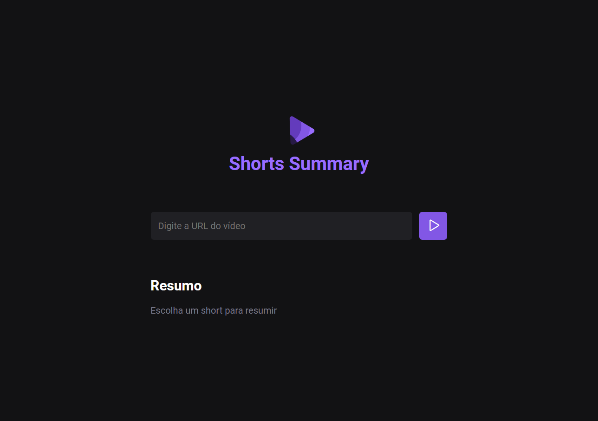

<p align="center">
  
</p>

## 💻 Projeto / Project

Desenvolvi um sistema que utiliza Inteligência Artificial para resumir em texto vídeos curtos do Youtube. O sistema é capaz de analisar o conteúdo dos vídeos e criar um resumo destacando os pontos-chave e as informações mais significativas.

---------------------------------------------------------------------------------

I developed a system that uses Artificial Intelligence to summarize short YouTube videos into text. The system is capable of analyzing the content of the videos and creating a summary highlighting the key points and most important information.

## 🚀 Tecnologias / Technologies

Esse projeto foi desenvolvido durante o NLW IA da Rocketseat com as seguintes tecnologias:

---------------------------------------------------------------------------------
This project was developed during Rocketseat's NLW IA with the following technologies:

- HTML
- CSS
- JavaScript
- Node.js
- IA
- Git & Github

## ❗ Como usar / How to use

```bash
# Faça o clone pelo terminal ou baixe o repositório pelo Github
  git clone git@github.com:Leonksx/Project-nlw-IA.git

# Acessar a pasta do projeto pelo terminal
  cd nlwia

# Faça a instalação das depêndencias
  npm i

# Executando o projeto frontend
  npm run web

# Executando o projeto backend
  npm run server

# Agora abra seu navegador e digite o endereço local
  Exemplo: https://localhost:5173/ 

# Selecione um Shorts de sua preferência no Youtube, Copie o link e realize o resumo do vídeo
```
## 👁‍🗨 Layout

Você pode visualizar o layout do projeto através [Deste Link](https://www.figma.com/file/6DjqMTlTJ24VIEWE28Jvmx/Project-NLW-IA---Shorts-Summary-%E2%80%A2-Trilha-Foundations?type=design&node-id=0-1&mode=design&t=BRxfPiqUjfG6xdiA-0).

É necessário ter uma conta do [Figma](https://www.figma.com).
